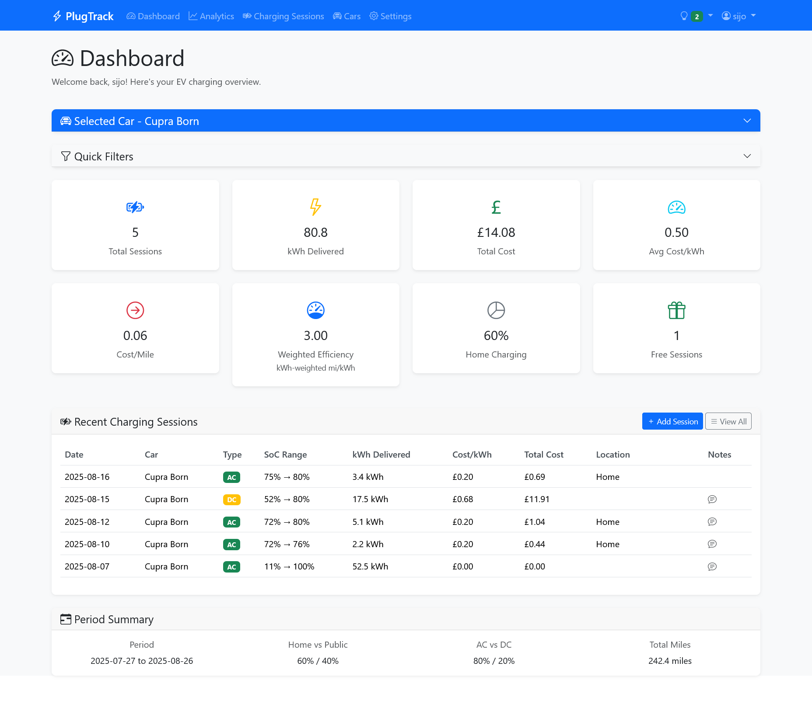
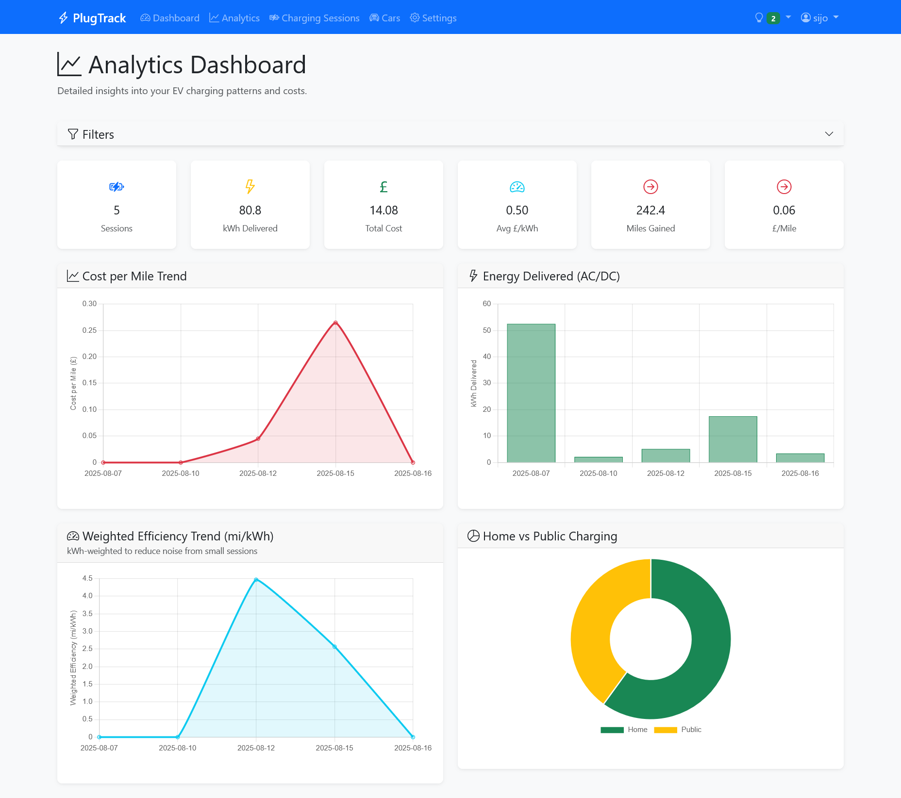
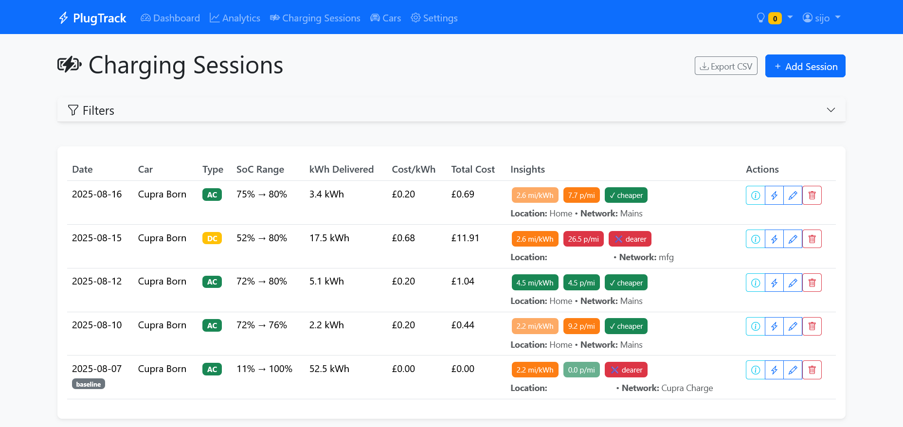
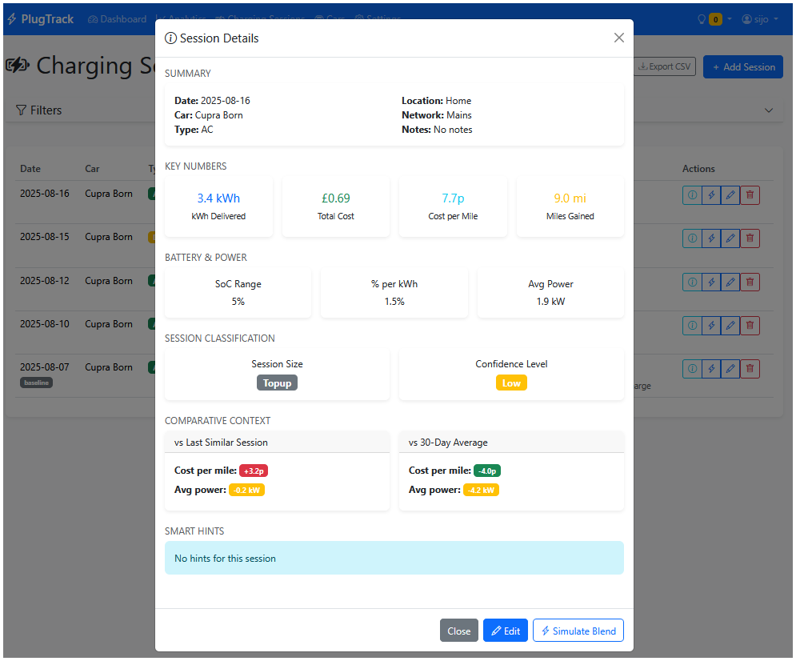
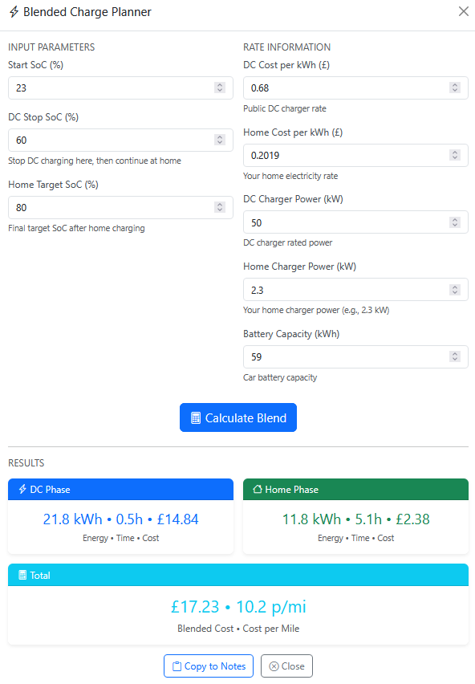
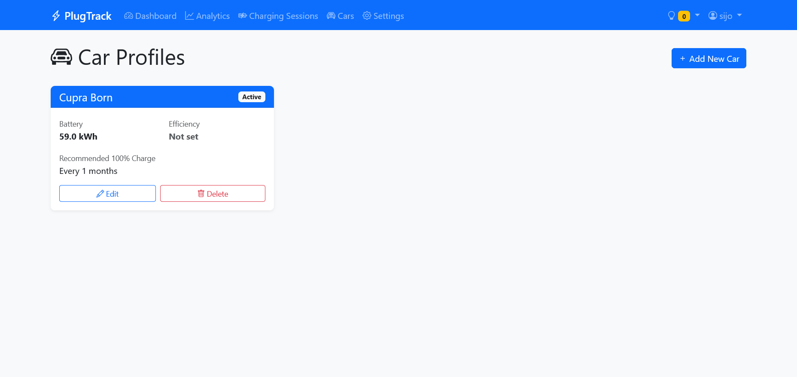
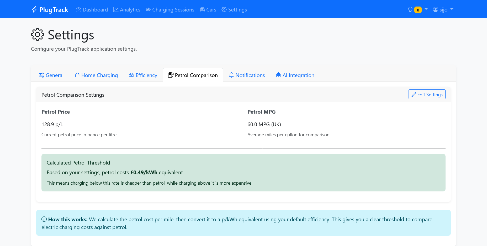

# PlugTrack - EV Charging Session Manager

PlugTrack is a smart personal web application for logging and managing EV charging sessions and car profiles. Built with Python Flask, it provides comprehensive tracking of your electric vehicle charging habits, costs, and efficiency with intelligent insights and recommendations.

## Features

### Smart Charging Management
- **Car Profiles**: Manage multiple vehicles with battery capacity, efficiency tracking, and recommended 100% charge frequency
- **Charging Sessions**: Log detailed charging sessions with cost tracking, SoC monitoring, location management, ambient temperature, and pre-conditioning usage
- **Smart Recommendations**: Automated charging advice based on your patterns and preferences
- **Session Insights**: Enhanced efficiency chips including £/10% SoC analysis, cost per mile, and petrol comparison
- **Context-Aware Analysis**: Track environmental conditions and pre-conditioning impact on charging efficiency

### Advanced Analytics & Insights
- **Comprehensive Dashboard**: Overview with lifetime totals, cost extremes, weighted efficiency, and achievement progress
- **Interactive Analytics**: Charts showing cost trends, efficiency patterns, charging mix, seasonal analysis, and location leaderboards
- **Enhanced Efficiency Insights**: £/10% SoC chips, Home ROI analysis vs 30-day baseline, and battery loss estimation
- **Location Intelligence**: Per-location median costs (£/kWh, £/mi), typical SoC patterns, session counts, and leaderboard rankings
- **Seasonal Analysis**: Efficiency vs ambient temperature analysis with visual charts and climate impact insights
- **Sweet Spot Analytics**: SoC window efficiency analysis to identify optimal charging ranges
- **Lifetime Statistics**: Complete overview of total kWh consumed, miles driven, costs, and savings vs petrol
- **Best/Worst Detection**: Automatically identifies your cheapest/most expensive sessions and efficiency extremes
- **Aggregated APIs**: Lightweight JSON endpoints for dashboard widgets and mobile integration
- **Data Filtering**: Filter by date range, car profile, charge type, network, and exclude pre-conditioning sessions

### Intelligent Reminder & Monitoring System
- **Battery Hygiene Dashboard**: Visual time distribution across SoC bands (<30%, 30-80%, >80%) for health monitoring
- **Smart 100% Charge Reminders**: Automated tracking with navbar notifications based on manufacturer recommendations
- **Multi-Level Urgency**: Color-coded alerts for due (1-3 days), overdue (4-7 days), and critical (>7 days) reminders
- **Auto-Clear Logic**: Reminders automatically clear when ≥95% SoC session is logged
- **Dashboard Integration**: Reminder cards appear when balance charging is needed

### Smart Coaching & Session Management
- **Dedicated Session Detail Pages**: Full-featured session analysis with tabbed interface for detailed insights and planning
- **Blended Charge Planner**: Simulate optimal DC + Home charging strategies with cost optimization and time estimates
- **Real-time Hints**: DC taper warnings, "finish at home" suggestions, storage SoC advice
- **Confidence Transparency**: User-friendly explanations of data quality with visual badges and detailed guidance modals
- **Smart Confidence System**: Visual indicators with clear explanations for data reliability factors
- **Comparative Analysis**: Compare sessions with similar conditions, rolling averages, and historical patterns
- **Session Quick View**: Modal popups for rapid session inspection with links to full detail pages
- **Comprehensive APIs**: RESTful endpoints for session metrics, insights, and real-time data access
- **Onboarding Wizard**: Guided first-run setup with user creation and optional car profile setup
- **Dark Theme Support**: Modern dark/light theme toggle with system preference detection and Chart.js integration

### Advanced Cost Analysis
- **Unified Parity System**: All EV parity rates display in p/kWh for direct tariff comparison
- **Persistent Cost Insights**: Calculated results panels that don't auto-dismiss for better decision making
- **Centralized Calculations**: Single source of truth for cost comparisons eliminates inconsistencies
- **Live Preview**: Real-time cost calculations when adjusting settings with UK average presets
- **Streamlined Settings**: Consolidated "Cost & Efficiency" page combines all pricing and efficiency controls

### Gamification & Achievement System
- **Comprehensive Achievement Engine**: 23+ unlockable badges for charging milestones and optimization goals
- **Smart Achievement Categories**: Cost optimization, power/speed records, time-based challenges, weather conditions, behavioral patterns, and exploration rewards
- **Weather-Based Achievements**: Winter Warrior (<5°C), Heatwave Hero (>30°C) using ambient temperature data
- **Milestone Tracking**: 1000 kWh Club, Road to 10,000, Century Session, and efficiency masters
- **Behavioral Rewards**: Range Anxiety challenges, Staycationer patterns, Explorer network usage, and charging optimization streaks
- **Visual Progress Dashboard**: Beautiful achievement widget with progress tracking, recent unlocks, and motivational locked previews
- **Real-time Notifications**: Flash messages when achievements are unlocked during session logging
- **Achievement API**: RESTful endpoints for unlocked/locked achievement status and progress tracking

### Data Management & Automation
- **Enhanced Data Capture**: Ambient temperature logging and tri-state pre-conditioning tracking (Unknown/No/Yes)
- **User Management**: Secure authentication with password hashing
- **Settings Management**: Configurable charging rates, preferences, thresholds, and advanced confidence parameters
- **Data Export**: CSV export functionality for charging sessions and comprehensive analytics
- **Advanced CLI Operations**: Import/export sessions, backup/restore, analytics export, reminder management, and session recomputation
- **Backup System**: ZIP-based backup and restore with merge/replace modes
- **Metrics Precomputation**: Background processing for instant session detail loading with consistency validation
- **Performance Optimization**: Precomputed efficiency, cost per mile, and loss percentage for faster page loads
- **Migration System**: Simplified baseline migrations with version tracking, rollback support, and dry-run capabilities

## Screenshots

**Dashboard Overview** - Main dashboard showing current car and recent sessions

**Analytics Dashboard** - Interactive charts and metrics for charging analysis

**Charging Sessions** - Charging Session page

**Session Detail** - Detailed view of a charging session with insights and recommendations

**Blended Charge Planner** - DC + Home charging simulation interface

**Car Management** - Add and manage multiple vehicle profiles

**Settings Panel** - Configure charging rates and preferences


## Technology Stack

- **Backend**: Python 3.11+, Flask 3.0 with comprehensive RESTful APIs
- **Database**: SQLite with SQLAlchemy ORM, optimized with performance indexes
- **Frontend**: Bootstrap 5, HTML5, CSS3, JavaScript with Chart.js for interactive analytics and gamification
- **APIs**: JSON REST endpoints for analytics, achievements, session metrics, and reminders
- **Authentication**: Flask-Login with secure password hashing
- **Security**: Encryption service for sensitive data
- **Migrations**: Flask-Migrate for database schema management with versioned migration system
- **Charts**: Chart.js for seasonal analysis, leaderboards, efficiency trends, and sweet spot visualization
- **CLI**: Click framework for command-line operations and data management

## Recent Updates

Phase 7 introduces a polished user experience with secure onboarding, performance optimizations, and modern UI enhancements. Key improvements include:

- **Secure Onboarding**: Replaced demo credentials with a guided first-run wizard for secure user creation
- **Performance Optimization**: Precomputed session metrics for faster page loads and improved responsiveness
- **Dark Theme Support**: Modern dark/light theme toggle with system preference detection and Chart.js integration
- **Enhanced CLI**: Improved command-line tools with verbosity options and better error handling
- **Migration Simplification**: Streamlined database migrations with baseline consolidation and better version tracking
- **Settings Consolidation**: Unified cost and efficiency settings in a single, intuitive interface

Building on Phase 6's comprehensive analytics and gamification features, Phase 7 delivers a production-ready experience that prioritizes security, performance, and user experience.

## Quick Start

### Prerequisites
- Python 3.11 or higher
- pip (Python package installer)

### Installation

1. **Clone the repository**
   ```bash
   git clone <repository-url>
   cd PlugTrack/plugtrack
   ```

2. **Create a virtual environment**
   ```bash
   python -m venv venv
   
   # On Windows
   venv\Scripts\activate
   
   # On macOS/Linux
   source venv/bin/activate
   ```

3. **Install dependencies**
   ```bash
   pip install -r requirements.txt
   ```

4. **Set up environment variables**
   ```bash
   # Copy the example environment file
   cp env_example.txt .env
   
   # Edit .env with your configuration
   # Generate required keys (see Security section below)
   ```

5. **Generate required keys**
   ```bash
   # Generate secret key
   python -c "import secrets; print(secrets.token_urlsafe(32))"
   
   # Generate encryption key
   python -c "from cryptography.fernet import Fernet; print(Fernet.generate_key().decode())"
   ```

6. **Initialize the database**
   ```bash
   # Using the convenient migration tool (recommended)
   python migrate.py init
   
   # Check what would be done without making changes
   python migrate.py init --dry-run
   
   # Alternative: Using Flask directly
   flask --app __init__ init-db
   ```

8. **Run the application**
   ```bash
   python run.py
   ```

9. **Access the application**
   - Open your browser to `http://localhost:5000`
   - Complete the onboarding wizard to create your first user account
   - Optionally set up your first car profile during onboarding

## Security

### First-Run Setup
PlugTrack uses a secure onboarding wizard for initial setup:
- **No default credentials**: Fresh installations require creating your first user account
- **Guided setup**: Onboarding wizard walks you through user creation and optional car profile setup
- **Secure by default**: No demo accounts or default passwords

### Production Security
For production deployment, ensure these security settings:

1. **Set SECRET_KEY**: Generate a secure random key
   ```bash
   python -c "import secrets; print(secrets.token_urlsafe(32))"
   ```

2. **Set ENCRYPTION_KEY**: Generate a Fernet encryption key
   ```bash
   python -c "from cryptography.fernet import Fernet; print(Fernet.generate_key().decode())"
   ```

3. **Create Admin User**: Use the admin creation command for additional users
   ```bash
   flask create-admin
   ```

### Security Features
- **Password Hashing**: Secure password storage using Werkzeug's security functions
- **Session Management**: Flask-Login with secure session handling
- **Data Encryption**: Sensitive data encrypted using Fernet encryption
- **CSRF Protection**: Built-in CSRF protection for forms
- **SQL Injection Protection**: SQLAlchemy ORM prevents SQL injection attacks

## Usage Guide

### Getting Started
1. **Onboarding**: Complete the guided setup wizard to create your first user account
2. **Car Setup**: Optionally create your first car profile during onboarding or add it later
3. **Configure Settings**: Set your home charging rate and other preferences
4. **Log Sessions**: Start recording your charging sessions
5. **View Analytics**: Explore the analytics dashboard for insights

### Key Features

#### Smart Recommendations
- Click the lightbulb icon in the top navigation to view charging recommendations
- Recommendations update based on your charging patterns
- Dismiss hints you don't want to see again

#### Analytics Dashboard
- Hover over charts for detailed information
- Use date ranges and car filters to analyze specific periods
- Download filtered data as CSV for external analysis

#### Blended Charge Planning
- Click "Simulate Blend" on any charging session
- Compare DC vs home charging costs
- Get realistic time and cost estimates for optimal charging strategies

#### CLI Operations
```bash
# Export sessions
flask --app . sessions-export --to exports/sessions.csv

# Import sessions (dry run first)
flask --app . sessions-import --from exports/sessions.csv --dry-run

# Create backup (create export directory first)
mkdir export
flask --app . backup-create --to exports/backup.zip

# Restore backup
flask --app . backup-restore --from exports/backup.zip --mode merge

# Recompute derived metrics for all sessions
flask --app . recompute-sessions --all --force
flask --app . recompute-sessions --user 1 --force
flask --app . recompute-sessions --session 123 --force

# Export aggregated analytics
flask --app . analytics-dump --user 1 --format json --pretty
flask --app . analytics-dump --format csv --output exports/analytics.csv

# Check 100% charge reminders
flask --app . reminders-run --user 1
flask --app . reminders-run --json

# Manual reminder operations
flask --app . reminders-run  # Check all users
flask --app . reminders-run --user 1 --verbose  # Detailed output for specific user

# CLI verbosity options (available for most commands)
flask --app . sessions-import --from exports/sessions.csv --verbose
flask --app . backup-create --to exports/backup.zip --quiet
flask --app . analytics-dump --format json --verbose
```

### Creating a New User
```bash
flask --app . create-admin
```

### Database Management

PlugTrack uses a modern migration system that provides:
- ✅ **Version tracking** - Know exactly which migrations have been applied
- ✅ **Automatic execution** - Single command handles fresh installs and updates
- ✅ **Rollback support** - Safely undo migrations if needed
- ✅ **Dry run capability** - Preview changes before applying
- ✅ **Backup creation** - Automatic backups before migrations
- ✅ **Dependency resolution** - Migrations run in correct order

```bash
# Using the convenient migration tool (recommended)
python migrate.py status                    # Check migration status
python migrate.py init                      # Initialize database
python migrate.py init --dry-run           # Preview initialization changes
python migrate.py init --force-fresh       # Force fresh installation
python migrate.py create 003 "Add feature" # Create new migration
python migrate.py organize                 # Organize legacy files
python migrate.py test                     # Test migration system

# Alternative: Using Flask directly (requires proper app specification)
flask --app __init__ migration-status
flask --app __init__ init-db
flask --app __init__ init-db --dry-run
flask --app __init__ create-migration 003 "Add feature"
flask --app __init__ apply-migrations
flask --app __init__ rollback-migration 003

# Alternative: Using Python scripts directly
python init_db_v2.py status
python init_db_v2.py init
python init_db_v2.py init --dry-run
```

### Backup and Restore Operations
```bash
# Create export directory (required for backups)
mkdir export

# Create a backup
flask --app . backup-create --to export/backup.zip

# Restore from backup (merge mode - adds to existing data)
flask --app . backup-restore --from export/backup.zip --mode merge

# Restore from backup (replace mode - overwrites existing data)
flask --app . backup-restore --from export/backup.zip --mode replace

# Dry run restore (see what would happen without making changes)
flask --app . backup-restore --from export/backup.zip --mode merge --dry-run
```

**Note**: The `export` directory must exist before running backup commands. The backup service creates temporary files in the same directory as the destination ZIP file.

## Configuration

### Environment Variables

| Variable | Description | Default |
|----------|-------------|---------|
| `SECRET_KEY` | Flask secret key | `dev-secret-key-change-in-production` |
| `FLASK_DEBUG` | Enable debug mode | `False` |
| `DATABASE_URL` | Database connection string | `sqlite:///plugtrack.db` |
| `ENCRYPTION_KEY` | Encryption key for sensitive data | Required |

### Default Settings
The following settings are automatically seeded with sensible defaults:
- **petrol_threshold_p_per_kwh**: 52.5 (p/kWh threshold for petrol comparison)
- **default_efficiency_mpkwh**: 4.1 (fallback efficiency if car profile missing)
- **home_aliases_csv**: "home,house,garage" (location keywords for home detection)
- **home_charging_speed_kw**: 2.3 (default home charging speed)
- **petrol_price_p_per_litre**: 128.9 (current petrol price)
- **petrol_mpg**: 60.0 (petrol efficiency for comparisons)
- **allow_efficiency_fallback**: 1 (enable efficiency fallback logic)

## Project Structure

```
plugtrack/
├── models/                 # Database models
│   ├── __init__.py
│   ├── user.py            # User authentication
│   ├── car.py             # Car profiles
│   ├── charging_session.py # Charging sessions
│   ├── settings.py        # User settings
│   └── session_meta.py    # Session metadata and hints
├── routes/                 # Flask routes/views
│   ├── __init__.py
│   ├── auth.py            # Authentication routes
│   ├── cars.py            # Car management
│   ├── charging_sessions.py # Session management
│   ├── settings.py        # Settings management
│   ├── dashboard.py       # Dashboard view
│   ├── analytics.py       # Analytics dashboard
│   └── blend.py           # Blended charging planner
├── services/               # Business logic
│   ├── __init__.py
│   ├── encryption.py      # Data encryption
│   ├── forms.py           # Form definitions
│   ├── derived_metrics.py # Analytics calculations
│   ├── hints.py           # Smart hints engine
│   ├── blend.py           # Blended charging logic
│   ├── reports.py         # CSV export functionality
│   ├── validators.py      # Validation and report types
│   ├── io_sessions.py     # CSV import/export service
│   ├── io_backup.py       # Backup/restore service
│   ├── baseline_manager.py # Baseline session management
│   ├── reminders.py       # 100% charge reminder engine
│   ├── cost_parity.py     # Centralized cost comparison calculations
│   └── formatting.py     # Consistent data formatting utilities
├── templates/              # HTML templates
│   ├── base.html          # Base template with navigation
│   ├── common/            # Shared templates and modals
│   ├── auth/              # Authentication templates
│   ├── cars/              # Car management templates
│   ├── charging_sessions/ # Session templates with insights
│   ├── settings/          # Settings templates
│   ├── dashboard/         # Dashboard templates
│   └── analytics/         # Analytics dashboard templates
├── static/                 # Static assets
│   ├── css/               # Stylesheets
│   └── js/                # JavaScript for interactivity
├── migrations/             # Database migration scripts
│   ├── add_phase4_fields_and_indexes.py
│   ├── seed_phase4_settings.py
│   ├── add_phase5_fields.py
│   └── 005_make_preconditioning_nullable.py
├── config.py               # Configuration
├── run.py                  # Application entry point
├── requirements.txt        # Python dependencies
├── test_phase4.py         # Test suite
├── test_phase5_metrics.py # Phase 5 metrics consistency tests
├── Dockerfile.dev          # Development Docker setup
└── docker-compose.dev.yml  # Development Docker Compose
```

## Development

### Docker Development Setup
```bash
# Build and run with Docker
docker-compose -f docker-compose.dev.yml up --build

# Access the application at http://localhost:5000
```

### Running Tests
```bash
python test_phase4.py
python unit-tests/test_phase5_metrics.py
```

## Contributing

1. Fork the repository
2. Create a feature branch (`git checkout -b feature/amazing-feature`)
3. Commit your changes (`git commit -m 'Add amazing feature'`)
4. Push to the branch (`git push origin feature/amazing-feature`)
5. Open a Pull Request

## License

This project is licensed under the MIT License - see the LICENSE file for details.

## Support

For support and questions, please open an issue on the GitHub repository.

## Acknowledgments

- Flask community for the excellent web framework
- Bootstrap team for the responsive UI framework
- SQLAlchemy team for the powerful ORM
- Chart.js team for the interactive charting library
- Click team for the CLI framework
